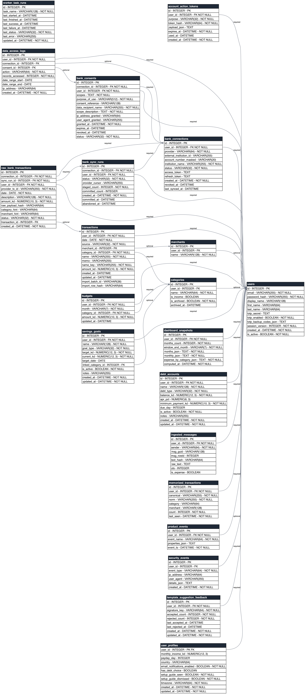

# Database Schema

Generated from SQLAlchemy metadata via `scripts/generate_schema_diagram.py`.

- Tables: 21
- Foreign-key relationships: 30

## Relationship annotations

### `account_action_tokens`

- `account_action_tokens.user_id` -> `users.id` (required)

### `bank_connections`

- `bank_connections.user_id` -> `users.id` (required)

### `bank_consents`

- `bank_consents.connection_id` -> `bank_connections.id` (required)
- `bank_consents.user_id` -> `users.id` (required)

### `bank_sync_runs`

- `bank_sync_runs.connection_id` -> `bank_connections.id` (required)
- `bank_sync_runs.user_id` -> `users.id` (required)

### `budgets`

- `budgets.user_id` -> `users.id` (required)
- `budgets.category_id` -> `categories.id` (required)

### `categories`

- `categories.user_id` -> `users.id` (optional)

### `dashboard_snapshots`

- `dashboard_snapshots.user_id` -> `users.id` (required)

### `data_access_logs`

- `data_access_logs.user_id` -> `users.id` (required)
- `data_access_logs.connection_id` -> `bank_connections.id` (optional)
- `data_access_logs.consent_id` -> `bank_consents.id` (optional)

### `debt_accounts`

- `debt_accounts.user_id` -> `users.id` (required)

### `ingested_messages`

- `ingested_messages.user_id` -> `users.id` (required)

### `memorized_transactions`

- `memorized_transactions.user_id` -> `users.id` (required)

### `merchants`

- `merchants.user_id` -> `users.id` (optional)

### `product_events`

- `product_events.user_id` -> `users.id` (required)

### `raw_bank_transactions`

- `raw_bank_transactions.connection_id` -> `bank_connections.id` (required)
- `raw_bank_transactions.sync_run_id` -> `bank_sync_runs.id` (required)
- `raw_bank_transactions.user_id` -> `users.id` (required)
- `raw_bank_transactions.transaction_id` -> `transactions.id` (optional)

### `savings_goals`

- `savings_goals.user_id` -> `users.id` (required)
- `savings_goals.linked_category_id` -> `categories.id` (optional)

### `security_events`

- `security_events.user_id` -> `users.id` (optional)

### `template_suggestion_feedback`

- `template_suggestion_feedback.user_id` -> `users.id` (required)

### `transactions`

- `transactions.user_id` -> `users.id` (required)
- `transactions.merchant_id` -> `merchants.id` (optional)
- `transactions.category_id` -> `categories.id` (required)

### `user_profiles`

- `user_profiles.user_id` -> `users.id` (required)
